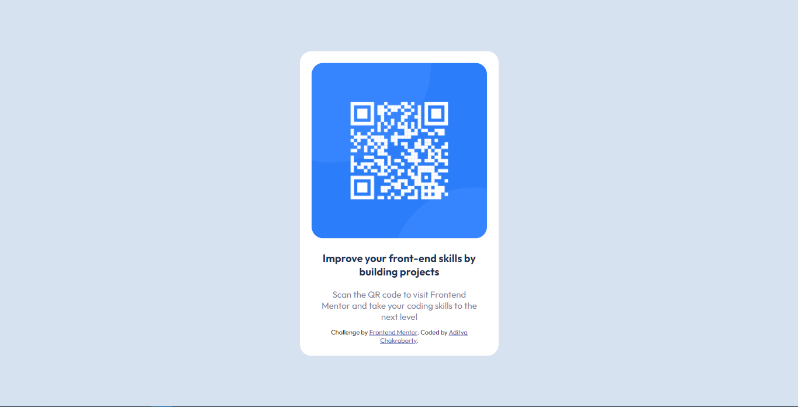

# Frontend Mentor - QR code component solution

This is a solution to the [QR code component challenge on Frontend Mentor](https://www.frontendmentor.io/challenges/qr-code-component-iux_sIO_H). Frontend Mentor challenges help you improve your coding skills by building realistic projects. 

## Table of contents

- [Overview](#overview)
  - [Screenshot](#screenshot)
  - [Links](#links)
- [My process](#my-process)
  - [Built with](#built-with)
  - [What I learned](#what-i-learned)
  - [Continued development](#continued-development)
- [Author](#author)


## Overview


### Screenshot




### Links

- Solution URL: (https://github.com/adityackr/qr-code-frontend/)
- Live Site URL: (https://adityackr.github.io/qr-code-frontend/)

## My process

### Built with

- Semantic HTML5 markup
- CSS custom properties
- Flexbox

### What I learned

```html
<h1>Some HTML code I'm proud of</h1>
```
```css
.proud-of-this-css {
  color: papayawhip;
}
```


### Continued development

I want to develop my skills in flexbox and grid and also responsiveness. I am still struggling with responsiveness


## Author

- Frontend Mentor - [@adityackr](https://www.frontendmentor.io/profile/adityackr)
- Facebook - [@aditya09036](https://www.facebook.com/aditya09036/)
- Linkedin - [@aditya-cuet](https://www.linkedin.com/in/aditya-cuet/)

